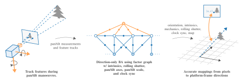

### ptcee: Calibration and estimation for pan/tilt cameras
Authors: **Martin Vonheim Larsen** (martin-vonheim.larsen (a) ffi.no)

&nbsp;[](https://pypi.python.org/pypi/b2)

`ptcee` is a core library for calibrating pan/tilt cameras written in C++.
She provides a [GTSAM](gtsam.org)-compatible implementation of the full pan/tilt system model used in the paper [Achieving Sub-Pixel Platform Accuracy with PTZ-Cameras in Uncertain Times](https://github.com/marvonlar/Paper-ptz-subpix-accuracy),
as well as routines for calibrating it.



This setup incorporates and calibrates the following parameters:
  - Perspective camera intrinsics with quadratic radial distortion
  - Rolling shutter model and -compensation
  - Clock synchronization between pan/tilt measurements and video feed
  - Arbitrary pan/tilt axes
  - Scaling bias on the pan/tilt measurements
  - Map of observed landmarks, on the unit sphere in the platform frame

The resulting calibrated model can be used together with pan/tilt measurements to create fairly accurate mappings from
pixels to directions in the platform frame.
Using the map of landmarks together with the frontend proposed in the paper enables such mappings with pixel accuracy.

### Using ptcee in your projects
We strongly recommend building and using ptcee with [conan](conan.io) and [CMake](https://cmake.org/).
You _can_ build and use it with plain CMake as well, but then you're on your own.
If you are new to conan, please read [Getting started](https://docs.conan.io/en/latest/getting_started.html) first.

<details>
  <summary>1. Download and export the conan recipe</summary>

As of writing we do not yet have an official ptcee recipe in conan center, so you'll have to download it manually.

```bash
git clone git@github.com:marvonlar/ptcee.git
conan export ptcee
rm -rf ptcee
```
</details>
<details>
  <summary>2. Add ptcee to your conanfile</summary>

Add `ptcee/1.0.0` to your conanfile.
</details>
<details>
  <summary>3. Add ptcee to your CMakeLists.txt</summary>

Assuming you have setup your CMake project properly with conan, the following should work:
```cmake
# --- snip ---

find_package(ptcee 1.0.0 REQUIRED)

# --- snip ---

target_link_libraries(my_target
  PUBLIC ptcee::ptcee
  )
```
</details>
<details>
  <summary>4. Use ptcee in your code</summary>

Typically, you will use ptcee through the `ptc::PTZEstimator` class, by executing the following steps:
1. Add pan/tilt measurements with `ptc::PTZEstimator::insertPanTilt()`.
2. Add landmark observations with `ptc::PTZEstimator::insertObservations()`.
3. Perform model calibration with `ptc::PTZEstimator::estimate()`.
4. Access the calibrated model with `ptc::PTZEstimator::getEstimate()`.

You have to obtain pan/tilt measurements and landmark observations yourself.
In code these steps can look like the following:

In code, we start by setting up an `ptc::PTZEstimator`, which requires initial guesses for the intrinsic camera model,
the clock offset `dt` between pan/tilt measurements and images, the line duration `ell` for rolling shutter, and the pan/tilt scaling parameter:

Here we setup an estimator for a FullHD camera assuming `f = 2000` (which means that hfov is approx. 25 degrees),
no radial distortion, `dt = 0`, global shutter and pan/tilt measurements with no scaling bias.
```cpp
#include "ptcee/ptz_estimator.h"

// --- snip ---

using Estimator = ptc::PTZEstimator<ptc::CalFK>;

const ptc::CalFK initial_cal{
  2000, // f
  0, // k
  1920, // w
  1080 // h
};
const auto initial_cal_cov
  = Eigen::Array2d{500, 1}.square().matrix().asDiagonal();

const double initial_dt = 0;
const Eigen::Matrix<double, 1, 1> initial_dt_cov{1};
const double initial_ell = 0;
const Eigen::Matrix<double, 1, 1> initial_ell_cov{1};
const Eigen::Vector2d initial_pt_scale{1, 1};
const Eigen::Array2d initial_pt_scale_cov{1e-1, 1e-1};

Estimator estimator{
  {initial_cal, initial_cal_cov},
  {initial_dt, initial_dt_cov},
  {initial_ell, initial_ell_cov},
  initial_pt_scale,
  initial_pt_scale_cov
};
```

Next, we insert noisy pan/tilt measurements with uncertain timestamps:
```cpp
for (const auto [t, pan, tilt] : pan_tilt_measurements)
{
  constexpr double sigma_t = 1e-3;
  constexpr double dt = 1/30; // time between pan/tilt measurements
  constexpr double sigma_dt = 1e-4;
  constexpr double sigma_pan_tilt = 1e-3;
  
  const Eigen::Matrix2d R_pan_tilt = Eigen::Array2d::Constant(sigma_pan_tilt).square().matrix().asDiagonal();
  
  estimator.insertPanTilt(
    {
      {t, sigma_t},
      {dt, sigma_dt}
    },
    {{pan, tilt}, R_pan_tilt}
  );
}
```

Then, we insert landmark observations from images. Here, you have to process the images and detect landmarks yourself
in `getObservations()`.
```cpp
for (const auto [t, img] : images)
{
  constexpr double sigma_t = 1e-3;
  constexpr double dt = 1/25.; // time between images
  constexpr double sigma_dt = 1e-4;
  
  std::map<size_t, ptc::Gaussian<Eigen::Vector2d>> observations;
  
  for (const auto [landmark_id, uv, R_uv] : getObservations(img))
  {
    observations[landmark_id] = ptc::Gaussian<Eigen::Vector2d>{uv, R_uv};
  }
  
  estimator.insertObservations(
    {
      {t, sigma_t},
      {dt, sigma_dt}
    },
    observations
  );
}
```

Finally, we are ready to perform the calibration, and obtain the result:
```cpp
estimator.estimate();

const auto estimate = estimator.getEstimate();
```

If we keep inserting pan/tilt measurements as they are received from the camera, we can use the above `estimate` to
obtain mappings from pixels (`some_uv`) to directions (`d_base`) in the platform frame as:
```cpp
const auto& dt = estimate.dt.x;
const auto& ell = estimate.ell.x;
const auto& cal = estimate.cal.x;
const auto& pan_axis = estimate.pan_axis.x;
const auto& tilt_axis = estimate.tilt_axis.x;
const auto& pt_scale = estimate.pt_scale.x;

for (const auto [t, img] : more_images)
{
  const auto [R_base_from_cam0, twist] = estimator.getRotAndTwist(
    t + dt,
    pan_axis,
    tilt_axis,
    pt_scale
  );
  
  const Eigen::Vector2d some_uv; // = ...
  
  const auto t_uv = ell*some_uv.y();
  const auto R_base_from_cam = R_base_from_cam0.retract(t_uv*twist);
  
  const auto d_base = R_base_from_cam*cal.reproject(uv);
  
  // todo: make profit 
}
```
</details>

## License

Source code is licensed under the [MIT License](https://opensource.org/licenses/MIT).
See [LICENSE](LICENSE).

### Citation

Please cite the Paper as:

**TBA**

Bibtex entry as follows:

**TBA**
